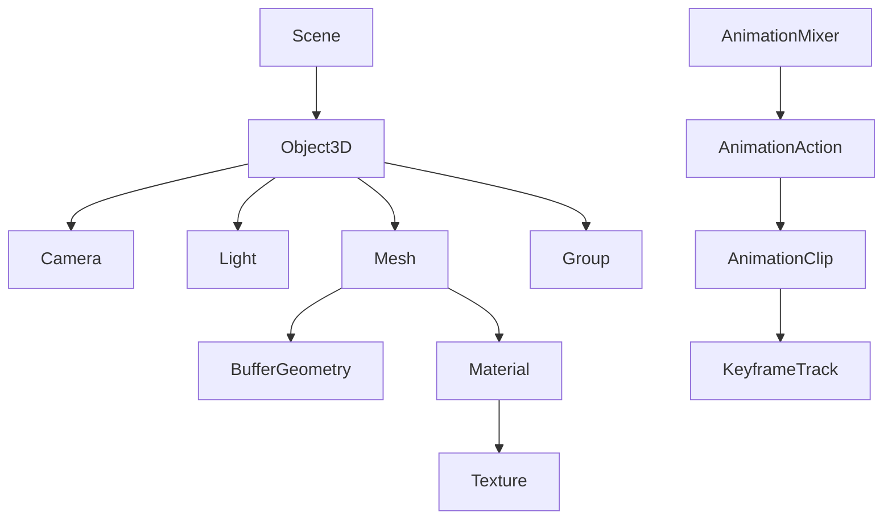

# Data Model: KreeKt Library

**Branch**: `001-create-the-spec` | **Date**: 2025-09-19

## Overview
This document defines the core data structures and relationships for the KreeKt multiplatform 3D graphics library. The model is designed to be platform-agnostic while providing Three.js API compatibility.

## Core Entities

### 1. Object3D (Base Entity)
**Purpose**: Foundation class for all objects in 3D space

**Properties**:
```kotlin
abstract class Object3D {
    val id: UUID
    var name: String
    val position: Vector3
    val rotation: Euler
    val scale: Vector3
    val quaternion: Quaternion
    var visible: Boolean
    var castShadow: Boolean
    var receiveShadow: Boolean
    val matrix: Matrix4
    val matrixWorld: Matrix4
    var matrixAutoUpdate: Boolean
    var parent: Object3D?
    val children: MutableList<Object3D>
    val layers: Layers
    val userData: MutableMap<String, Any>
}
```

**Relationships**:
- Parent-child hierarchy (Scene Graph)
- Bidirectional references maintained automatically

**Validation Rules**:
- ID must be unique within a Scene
- Scale components must be non-zero
- Matrix must be non-singular for rendering

### 2. Scene
**Purpose**: Root container for all renderable objects

**Properties**:
```kotlin
class Scene : Object3D() {
    var background: Background?
    var environment: Texture?
    var fog: Fog?
    var overrideMaterial: Material?
    var autoUpdate: Boolean
}

sealed class Background {
    data class Color(val color: Color) : Background()
    data class Texture(val texture: CubeTexture) : Background()
    data class Gradient(val top: Color, val bottom: Color) : Background()
}
```

**Validation Rules**:
- Scene cannot have a parent
- Background texture must be cubic for environment mapping
- Environment texture affects all materials unless overridden

### 3. Camera (Abstract Base)
**Purpose**: Defines viewpoint and projection for rendering

**Properties**:
```kotlin
abstract class Camera : Object3D() {
    val projectionMatrix: Matrix4
    val matrixWorldInverse: Matrix4
    var near: Float
    var far: Float

    abstract fun updateProjectionMatrix()
    abstract fun setViewOffset(fullWidth: Int, fullHeight: Int, x: Int, y: Int, width: Int, height: Int)
}

class PerspectiveCamera(
    var fov: Float = 50f,
    var aspect: Float = 1f,
    near: Float = 0.1f,
    far: Float = 2000f
) : Camera() { ... }

class OrthographicCamera(
    var left: Float,
    var right: Float,
    var top: Float,
    var bottom: Float,
    near: Float = 0.1f,
    far: Float = 2000f
) : Camera() { ... }
```

**Validation Rules**:
- near > 0 and far > near
- FOV between 1° and 179°
- Aspect ratio > 0

### 4. BufferGeometry
**Purpose**: Efficient geometry representation using typed arrays

**Properties**:
```kotlin
class BufferGeometry {
    val id: UUID
    var name: String
    val attributes: MutableMap<String, BufferAttribute>
    var index: BufferAttribute?
    var drawRange: DrawRange
    val groups: MutableList<GeometryGroup>
    var boundingBox: Box3?
    var boundingSphere: Sphere?

    // Standard attributes
    var position: BufferAttribute?
    var normal: BufferAttribute?
    var uv: BufferAttribute?
    var uv2: BufferAttribute?
    var color: BufferAttribute?
}

class BufferAttribute(
    val array: TypedArray,
    val itemSize: Int,
    var normalized: Boolean = false
) {
    val count: Int get() = array.size / itemSize
    var needsUpdate: Boolean = true
}

data class DrawRange(
    val start: Int = 0,
    val count: Int = -1 // -1 means all
)
```

**Validation Rules**:
- Position attribute required for rendering
- ItemSize must match attribute semantics (position=3, normal=3, uv=2)
- Array size must be divisible by itemSize

### 5. Material (Abstract Base)
**Purpose**: Defines surface appearance and shading behavior

**Properties**:
```kotlin
abstract class Material {
    val id: UUID
    var name: String
    var transparent: Boolean
    var opacity: Float
    var alphaTest: Float
    var side: Side
    var depthTest: Boolean
    var depthWrite: Boolean
    var blending: Blending
    var needsUpdate: Boolean
    val userData: MutableMap<String, Any>
}

class MeshStandardMaterial : Material() {
    var color: Color
    var roughness: Float
    var metalness: Float
    var map: Texture?
    var normalMap: Texture?
    var roughnessMap: Texture?
    var metalnessMap: Texture?
    var emissive: Color
    var emissiveMap: Texture?
    var emissiveIntensity: Float
}

enum class Side { FRONT, BACK, DOUBLE }
enum class Blending { NORMAL, ADDITIVE, SUBTRACTIVE, MULTIPLY }
```

**Validation Rules**:
- Opacity between 0.0 and 1.0
- Roughness and metalness between 0.0 and 1.0
- AlphaTest between 0.0 and 1.0

### 6. Texture
**Purpose**: Image data applied to materials

**Properties**:
```kotlin
class Texture {
    val id: UUID
    var name: String
    val image: TextureSource?
    var mapping: TextureMapping
    var wrapS: TextureWrapping
    var wrapT: TextureWrapping
    var magFilter: TextureFilter
    var minFilter: TextureFilter
    var format: TextureFormat
    var type: TextureType
    var anisotropy: Int
    var offset: Vector2
    var repeat: Vector2
    var center: Vector2
    var rotation: Float
    var generateMipmaps: Boolean
    var needsUpdate: Boolean
}

enum class TextureMapping { UV, CUBE_REFLECTION, CUBE_REFRACTION, EQUIRECTANGULAR }
enum class TextureWrapping { REPEAT, CLAMP_TO_EDGE, MIRRORED_REPEAT }
enum class TextureFilter { NEAREST, LINEAR, NEAREST_MIPMAP_NEAREST, LINEAR_MIPMAP_NEAREST, NEAREST_MIPMAP_LINEAR, LINEAR_MIPMAP_LINEAR }
```

**Validation Rules**:
- Image dimensions must be power of 2 for mipmaps
- Anisotropy must be power of 2 (1, 2, 4, 8, 16)
- Rotation in radians

### 7. Light (Abstract Base)
**Purpose**: Illumination sources for realistic rendering

**Properties**:
```kotlin
abstract class Light : Object3D() {
    var color: Color
    var intensity: Float
    var castShadow: Boolean
    val shadow: LightShadow?
}

class DirectionalLight(
    color: Color = Color.WHITE,
    intensity: Float = 1f
) : Light() {
    val target: Object3D = Object3D()
}

class PointLight(
    color: Color = Color.WHITE,
    intensity: Float = 1f,
    var distance: Float = 0f,
    var decay: Float = 2f
) : Light()

class SpotLight(
    color: Color = Color.WHITE,
    intensity: Float = 1f,
    var distance: Float = 0f,
    var angle: Float = Math.PI / 3,
    var penumbra: Float = 0f,
    var decay: Float = 2f
) : Light() {
    val target: Object3D = Object3D()
}
```

**Validation Rules**:
- Intensity >= 0
- Distance >= 0 (0 = infinite)
- Spot angle between 0 and π/2
- Penumbra between 0.0 and 1.0

### 8. Mesh
**Purpose**: Renderable object combining geometry and material

**Properties**:
```kotlin
class Mesh(
    var geometry: BufferGeometry?,
    var material: Material?
) : Object3D() {

    fun raycast(raycaster: Raycaster, intersects: MutableList<Intersection>)
    fun updateMorphTargets()
}

data class Intersection(
    val distance: Float,
    val point: Vector3,
    val face: Face3?,
    val faceIndex: Int,
    val object: Object3D,
    val uv: Vector2?
)
```

**Validation Rules**:
- Geometry and material required for rendering
- Morph targets must have same vertex count as base geometry

### 9. Animation System
**Purpose**: Time-based property animations

**Properties**:
```kotlin
class AnimationClip(
    val name: String,
    val duration: Float,
    val tracks: List<KeyframeTrack>
)

abstract class KeyframeTrack(
    val name: String,
    val times: FloatArray,
    val values: FloatArray
) {
    abstract fun interpolate(time: Float): Any
}

class VectorKeyframeTrack(
    name: String,
    times: FloatArray,
    values: FloatArray
) : KeyframeTrack(name, times, values)

class QuaternionKeyframeTrack(
    name: String,
    times: FloatArray,
    values: FloatArray
) : KeyframeTrack(name, times, values)

class AnimationMixer(val root: Object3D) {
    fun clipAction(clip: AnimationClip): AnimationAction
    fun update(deltaTime: Float)
}
```

**Validation Rules**:
- Times array must be sorted and positive
- Values array size must match times array * component count
- Duration must match maximum time value

## Data Relationships



## State Transitions

### Object3D Transform Updates
```
Matrix Update Needed → updateMatrix() → Matrix Current
Matrix World Needed → updateMatrixWorld() → Matrix World Current
```

### Material Changes
```
Property Changed → needsUpdate = true → Shader Recompile → Render Ready
```

### Texture Loading
```
Created → Loading → Loaded → GPU Upload → Render Ready
```

### Animation Playback
```
Stopped → Playing → Paused → Playing → Finished
```

## Memory Management

### Reference Counting
- Parent objects hold strong references to children
- Materials reference textures (shared references allowed)
- Geometries can be shared between multiple meshes

### Disposal Pattern
```kotlin
interface Disposable {
    fun dispose()
    val disposed: Boolean
}
```

All GPU resources implement Disposable for explicit cleanup.

### Weak References
- Event listeners use weak references to prevent memory leaks
- Animation targets use weak references to allow garbage collection

## Platform Considerations

### Common (expect/actual)
```kotlin
expect class TypedArray
expect class Float32Array : TypedArray
expect class Uint16Array : TypedArray
expect class Uint32Array : TypedArray
```

### Platform-Specific Extensions
- **JS**: Direct TypedArray mapping
- **JVM**: NIO ByteBuffer wrapper
- **Native**: Kotlin/Native arrays with C interop

## Performance Optimizations

### Object Pooling
- Vector3, Matrix4, Quaternion objects pooled for frequent operations
- Intersection results pooled for raycasting

### Dirty Flagging
- Transform matrices only updated when needed
- Material uniforms only uploaded when changed
- Geometry buffers only re-uploaded when modified

### Batch Processing
- Multiple objects with same material/geometry batched
- Instanced rendering for repeated objects
- Frustum culling before rendering

---
*All entities follow immutable-by-default principle with explicit mutation methods*