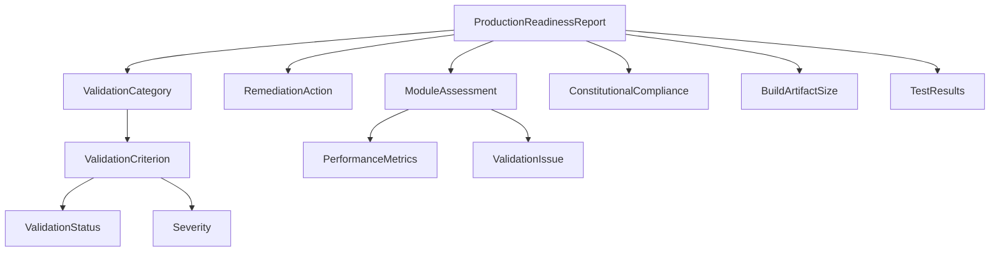

# Data Model: Production Readiness Confirmation

## Core Entities

### ProductionReadinessReport

**Description**: Overall assessment of codebase production readiness

```kotlin
data class ProductionReadinessReport(
    val timestamp: Instant,
    val branchName: String,
    val commitHash: String,
    val overallStatus: ValidationStatus,
    val overallScore: Float, // 0.0 to 1.0
    val categories: List<ValidationCategory>,
    val remediationActions: List<RemediationAction>,
    val executionTime: Duration
)
```

### ValidationCategory

**Description**: High-level grouping of related validation criteria

```kotlin
data class ValidationCategory(
    val name: String, // "Compilation", "Testing", "Performance", "Security", "Constitutional"
    val status: ValidationStatus,
    val score: Float, // 0.0 to 1.0
    val weight: Float, // Importance weight for overall score
    val criteria: List<ValidationCriterion>
)
```

### ValidationCriterion

**Description**: Individual validation check with results

```kotlin
data class ValidationCriterion(
    val id: String,
    val name: String,
    val description: String,
    val requirement: String, // Expected value/threshold
    val actual: String, // Measured value
    val status: ValidationStatus,
    val severity: Severity,
    val details: Map<String, Any>,
    val platform: Platform? = null // Platform-specific criterion
)
```

### ValidationStatus

**Description**: Result status of validation checks

```kotlin
enum class ValidationStatus {
    PASSED,
    FAILED,
    WARNING,
    SKIPPED,
    ERROR
}
```

### Severity

**Description**: Issue severity levels

```kotlin
enum class Severity {
    CRITICAL, // Blocks production release
    HIGH,     // Should be fixed before release
    MEDIUM,   // Should be addressed soon
    LOW       // Nice to fix
}
```

### RemediationAction

**Description**: Actionable step to fix a validation failure

```kotlin
data class RemediationAction(
    val criterionId: String,
    val title: String,
    val description: String,
    val steps: List<String>,
    val estimatedEffort: String, // "5 minutes", "1 hour", etc.
    val priority: Int, // 1 = highest
    val automatable: Boolean,
    val command: String? = null // Optional automation command
)
```

### Platform

**Description**: Target platform for validation

```kotlin
enum class Platform {
    JVM,
    JS,
    NATIVE_LINUX_X64,
    NATIVE_WINDOWS_X64,
    NATIVE_MACOS_X64,
    NATIVE_MACOS_ARM64,
    ANDROID,
    IOS,
    WATCHOS,
    TVOS
}
```

### ModuleAssessment

**Description**: Per-module validation results

```kotlin
data class ModuleAssessment(
    val moduleName: String,
    val path: String,
    val status: ValidationStatus,
    val testCoverage: Float?,
    val compilationStatus: Map<Platform, Boolean>,
    val performanceMetrics: PerformanceMetrics?,
    val issues: List<ValidationIssue>
)
```

### PerformanceMetrics

**Description**: Performance measurement results

```kotlin
data class PerformanceMetrics(
    val fps: FpsMetrics,
    val memory: MemoryMetrics,
    val initialization: InitMetrics,
    val renderingLoad: RenderingLoad
)

data class FpsMetrics(
    val min: Float,
    val average: Float,
    val max: Float,
    val p95: Float,
    val p99: Float,
    val meetsRequirement: Boolean // >= 120 FPS
)

data class MemoryMetrics(
    val heapUsed: Long,
    val gpuMemory: Long?,
    val withinBudget: Boolean
)

data class InitMetrics(
    val timeMillis: Long,
    val meetsRequirement: Boolean // < 2000ms
)

data class RenderingLoad(
    val triangleCount: Int,
    val drawCalls: Int,
    val textureMemory: Long
)
```

### ValidationIssue

**Description**: Specific issue found during validation

```kotlin
data class ValidationIssue(
    val type: IssueType,
    val location: CodeLocation,
    val message: String,
    val suggestion: String?,
    val canAutoFix: Boolean
)

data class CodeLocation(
    val file: String,
    val line: Int?,
    val column: Int?
)

enum class IssueType {
    PLACEHOLDER_CODE,
    MISSING_TEST,
    LOW_COVERAGE,
    PERFORMANCE_REGRESSION,
    SECURITY_VULNERABILITY,
    COMPILATION_ERROR,
    MISSING_EXPECT_ACTUAL,
    API_INCONSISTENCY,
    DOCUMENTATION_MISSING,
    CONSTITUTIONAL_VIOLATION
}
```

### ConstitutionalCompliance

**Description**: Validation against constitution.md principles

```kotlin
data class ConstitutionalCompliance(
    val tddCompliance: Boolean,
    val productionReadyCode: Boolean,
    val crossPlatformCompatibility: Boolean,
    val performanceStandards: Boolean,
    val typeSafety: Boolean,
    val violations: List<ConstitutionalViolation>
)

data class ConstitutionalViolation(
    val principle: String,
    val description: String,
    val evidence: String,
    val location: CodeLocation?
)
```

### BuildArtifactSize

**Description**: Size validation for build artifacts

```kotlin
data class BuildArtifactSize(
    val platform: Platform,
    val artifactPath: String,
    val sizeBytes: Long,
    val sizeFormatted: String, // "1.8 MB"
    val meetsRequirement: Boolean, // < 2 MB
    val optimizationSuggestions: List<String>
)
```

### TestResults

**Description**: Test execution summary

```kotlin
data class TestResults(
    val totalTests: Int,
    val passedTests: Int,
    val failedTests: Int,
    val skippedTests: Int,
    val coverage: CoverageMetrics,
    val duration: Duration,
    val failureDetails: List<TestFailure>
)

data class CoverageMetrics(
    val linePercentage: Float,
    val branchPercentage: Float,
    val meetsRequirement: Boolean // >= 95% line coverage
)

data class TestFailure(
    val testName: String,
    val className: String,
    val message: String,
    val stackTrace: String
)
```

### ValidationConfiguration

**Description**: Configuration for validation execution

```kotlin
data class ValidationConfiguration(
    val enabledCategories: Set<String>,
    val platforms: Set<Platform>,
    val performanceRequirements: PerformanceRequirements,
    val coverageThreshold: Float = 95.0f,
    val maxArtifactSize: Long = 2_097_152L, // 2 MB in bytes
    val failFast: Boolean = false,
    val generateHtmlReport: Boolean = true,
    val outputDirectory: String = "build/validation-reports"
)

data class PerformanceRequirements(
    val minFps: Float = 120.0f,
    val maxInitTime: Long = 2000L,
    val maxMemoryUsage: Long? = null
)
```

## Relationships



## State Transitions

### ValidationStatus Transitions

```
PENDING → RUNNING → {PASSED, FAILED, WARNING, ERROR}
FAILED → RUNNING (on retry) → {PASSED, FAILED}
```

### Report Generation Flow

```
1. Initialize → Load Configuration
2. Execute Compilation Validation
3. Execute Test Suite
4. Execute Performance Benchmarks
5. Execute Security Scans
6. Execute Constitutional Checks
7. Aggregate Results
8. Generate Remediation Actions
9. Output Report
```

## Validation Rules

1. **Overall Status Calculation**:
    - PASSED: All critical criteria pass, warnings allowed
    - FAILED: Any critical criterion fails
    - WARNING: All pass but with warnings
    - ERROR: Validation could not complete

2. **Score Calculation**:
   ```kotlin
   overallScore = sum(category.score * category.weight) / sum(category.weights)
   ```

3. **Platform Availability**:
    - Skip platform if toolchain not available
    - Report as WARNING not FAILED
    - Document in remediation actions

4. **Remediation Priority**:
    - Critical failures: Priority 1
    - High severity: Priority 2
    - Medium severity: Priority 3
    - Low severity: Priority 4

## Data Persistence

### Report Storage

- JSON format for machine processing
- HTML format for human viewing
- Stored in `build/validation-reports/`
- Timestamped filenames: `validation-{timestamp}.json`

### Historical Tracking

- Keep last 10 validation reports
- Track trends over time
- Identify regressions

### CI/CD Integration

- Exit code based on validation status
- Machine-readable output for parsing
- GitHub Actions annotations support